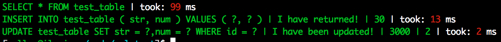

# blackwater

A Clojure library for logging SQL queries and the time they took for Korma and clojure.java.jdbc

## Marginalia Documentation

[Marginalia documentation](https://rawgithub.com/bitemyapp/blackwater/master/docs/uberdoc.html)

## Usage

In Leiningen add:

    [blackwater "0.0.5"]

to your :dependencies.

Then, in your ns form:

    [black.water :refer [decorate-cjj! decorate-korma!]]

And invoke decorate-korma! or decorate-cjj! as appropriate. Thanks to technomancy's robert.hooke these operations are idempotent, but still marked with a `!` because they *ARE* modifying c.j.j and Korma.

To disable the ANSI coloring, set `*use-ansi*` in the clansi ns to false.

To customize ANSI coloring, set *time-color* or *sql-color* in the black.water ns. By default they are `:red` and `:green` respectively, check clansi for valid color symbols.

## Development

You need to init a sqlite test database named `test.sql` at the top level of the project.

    sqlite3 test.sql
    CREATE TABLE test_table(id INTEGER PRIMARY KEY ASC, num, str);

Now your `lein test` should pass and you're ready to develop.

## Warning

Note that the Korma functionality/logging is more likely to be comprehensive than c.j.j's because it has a cleaner and more uniform API. If you think this library is failing to log something for c.j.j, it probably *is* and I would request that you file a Github issue with bitemyapp/blackwater.

## License

Copyright © 2013 Chris Allen

Distributed under the Eclipse Public License either version 1.0 or any later version.
